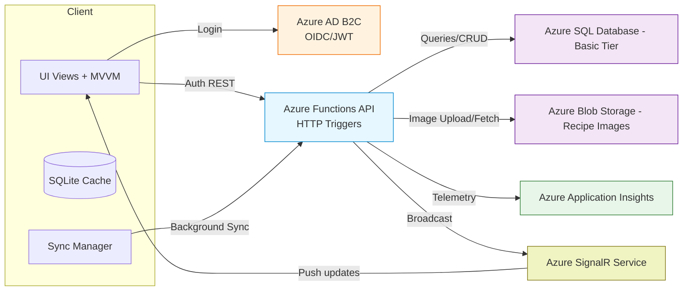
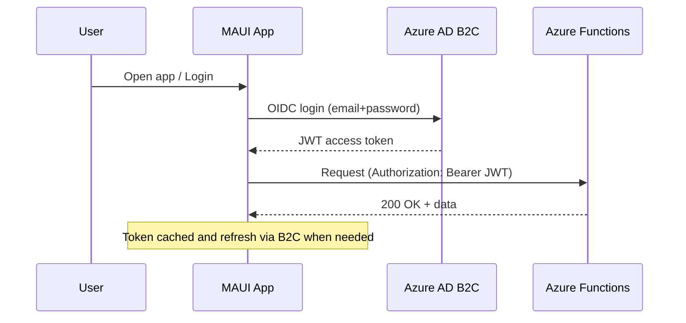
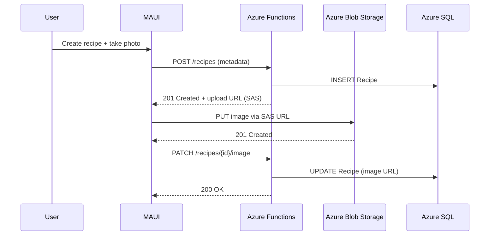
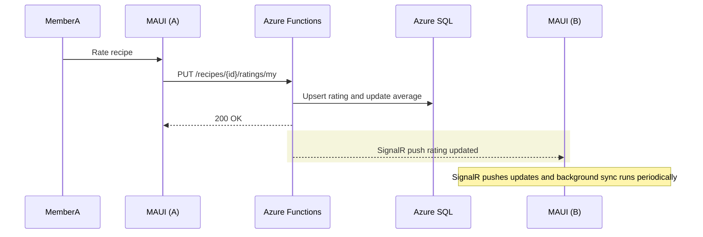
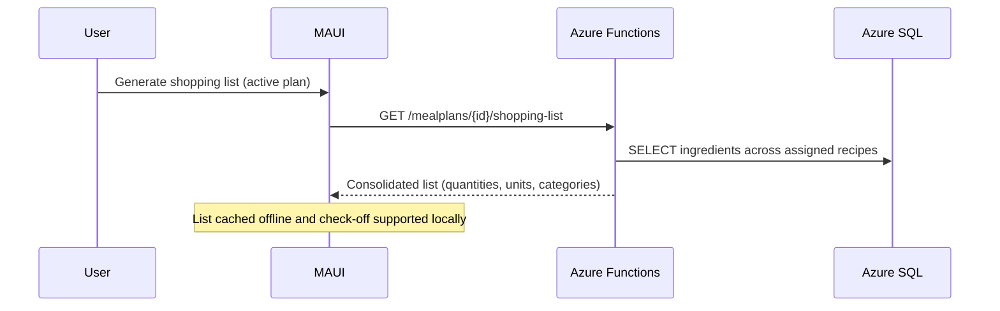
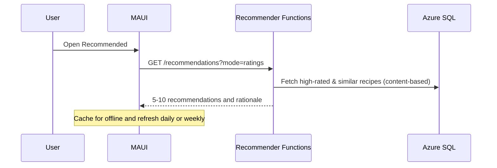
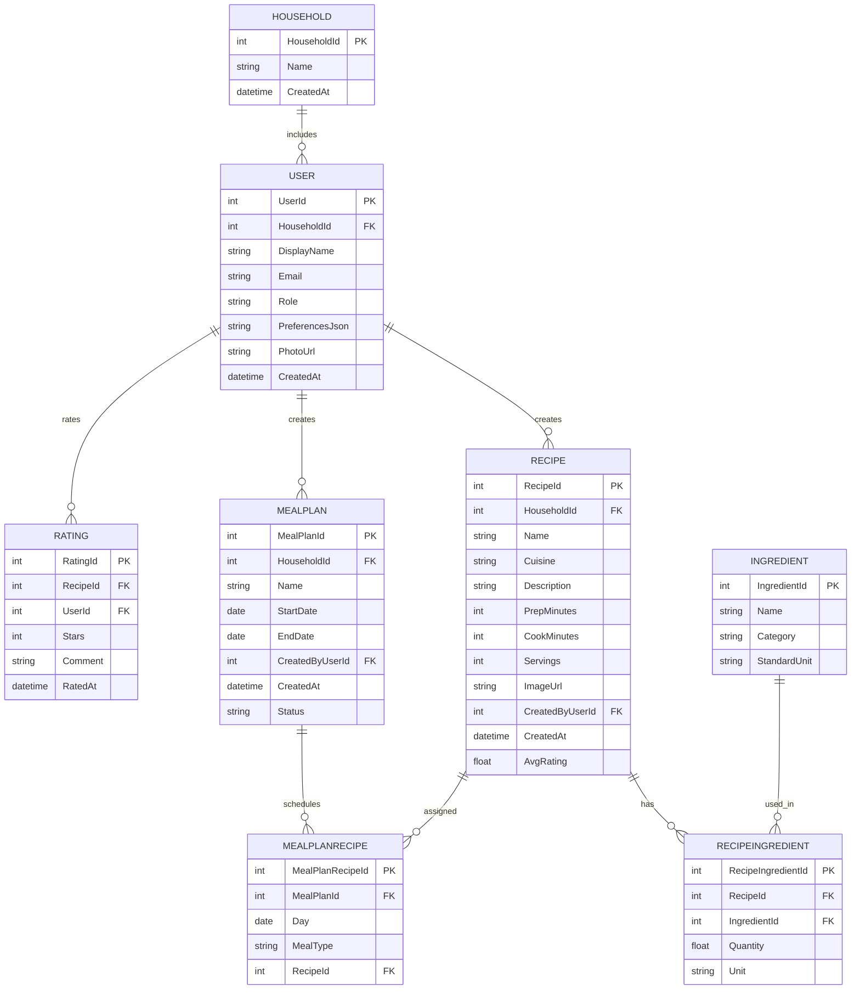

# Meal Plan Organizer – System Architecture

## Overview
The Meal Plan Organizer is a mobile-first application for a single household (2 adults, 2 teens) to manage recipes, ratings, meal plans, and recommendations. Mobile apps are built with .NET MAUI (iOS/Android). Backend services run on Microsoft Azure with a monthly budget target under $50.

## Architecture Goals
- Security-first with household data isolation
- Offline-first mobile experience with background sync
- Low operational cost (Azure consumption tiers, basic SKUs)
- Simple, maintainable services with clear boundaries

## Core Components
- Mobile Clients: .NET MAUI apps (iOS/Android) using MVVM
- API Layer: Azure Functions (HTTP-triggered, .NET) — stateless REST endpoints
- Authentication: Azure AD B2C (OIDC/JWT)
- Database: Azure SQL Database (Basic tier)
- Storage: Azure Blob Storage (images)
- Observability: Azure Application Insights + Log Analytics
- Real-time: Azure SignalR Service (required for ratings and meal plan changes)

## High-Level Architecture Diagram


## Key Interaction Diagrams

### Authentication & Session


### Add Recipe & Image Upload


### Rate Recipe & Household Sync


### Generate Shopping List from Meal Plan


### Recommendations


## Data Model (ER Overview)


## API Surface (Mapped to Azure Functions)
- Auth: `/auth/login` (B2C via OIDC), `/auth/refresh`
- Users: `GET/PUT /users/me`, `POST /households/invite`, `POST /households/join`
- Recipes: `GET /recipes`, `GET /recipes/{id}`, `POST /recipes`, `PUT /recipes/{id}`, `DELETE /recipes/{id}`
- Ratings: `PUT /recipes/{id}/ratings/my`, `GET /recipes/{id}/ratings`
- Meal Plans: `GET /mealplans`, `GET /mealplans/{id}`, `POST`, `PUT`, `DELETE`
- Shopping List: `GET /mealplans/{id}/shopping-list`
- Recommendations: `GET /recommendations?mode=ratings|ingredients|popular`
- Pantry: `GET/POST/PUT/DELETE /pantry/items`

## Security Architecture
- Identity: Azure AD B2C for OIDC; tokens validated by Azure Functions middleware
- Authorization: Household-level access via `HouseholdId` scoping; server-side checks on all operations
- Transport: HTTPS/TLS enforced; CORS restricted to mobile app origins
- Data: Secrets in Azure Key Vault; passwords only in B2C; app uses parameterized queries
- Threats: OWASP Top 10 mitigations; rate limiting on sensitive endpoints

## Reliability & Observability
- Backups: Azure SQL automatic backups (30-day retention); documented restore
- Monitoring: Application Insights for traces, metrics, exceptions; custom alerts on error rate/latency
- Resilience: Retry policies on DB and storage; graceful offline fallbacks

## Performance & Cost Optimization
- Compute: Azure Functions (consumption) for bursty workloads
- DB: Azure SQL Basic tier; indexes on common search fields; connection pooling
- Images: Client-side compression; server-side resize; CDN deferred
- Caching: Local SQLite; server-side caching for recommendations where useful
- Budget Controls: Cost alerts; monitor weekly; avoid premium services initially; defer SignalR until necessary

## Offline Strategy
- Local Cache: SQLite per device for recipes, meal plans, and shopping lists
- Sync Protocol: Timestamp/ETag-based incremental sync; conflict policy: last-write-wins with user hints for sensitive items
- Background Sync: On app resume or periodic intervals; manual refresh control

## Deployment & Environments
- CI/CD: GitHub Actions for build/test/deploy of Functions and MAUI
- Config: Use environment variables and Key Vault
- Environments: `dev` and `prod` with separate B2C, SQL, Storage

## Risks & Mitigations
- Real-time Costs: Start with background sync; enable SignalR only if needed
- Data Consistency: Use transactions for multi-table writes; add DB constraints
- Mobile Variability: Test across common device sizes; performance profiling

## Appendix: Mapping to Requirements
- Covers `PROJECT_SPEC.md` core features and aligns endpoints with `USER_STORIES_AND_REQUIREMENTS.md` (US-001..US-028, FR/NFR sections)

---

# End of Architecture Document
 
## SignalR Cost Estimate (Brief)
- Context: 1 household, low concurrency (≤10 connections), limited events for ratings and meal plan changes.
- Approach: Use Azure SignalR Service in serverless mode with one low-tier unit, WebSocket transport preferred.
- Expectation: With minimal traffic, a single unit typically fits within the <$50/month total budget when combined with Functions, SQL Basic, and Storage. Exact pricing varies by region and SKU; verify in Azure Cost Management.
- Cost controls:
  - Scope broadcasts to ratings and meal-plan events only.
  - Use household groups to limit fan-out.
  - Avoid verbose logs; use batched updates where acceptable.
  - Configure budget alerts (80% and 100%).

## Monitoring & Dashboard (Application Insights + Azure Monitor)
- Enable Application Insights for Azure Functions (connection string in app settings).
- Emit custom telemetry for broadcasts:
  - TrackEvent: RatingUpdatedBroadcast, MealPlanChangedBroadcast
  - Dimensions: `householdId`, `recipeId|mealPlanId`, `userId`
- Create a Workbook (App Insights) with tiles:
  - Requests p95 by endpoint (Function performance):
    ```kusto
    requests
    | where timestamp >= ago(24h)
    | summarize p95_duration = percentile(duration, 95) by name
    | order by p95_duration desc
    ```
  - Broadcast counts (custom events):
    ```kusto
    customEvents
    | where name in ("RatingUpdatedBroadcast","MealPlanChangedBroadcast")
    | summarize count() by name, bin(timestamp, 1h)
    | order by timestamp asc
    ```
  - SignalR dependency latency and success:
    ```kusto
    dependencies
    | where name contains "SignalR"
    | summarize calls = count(), avg_ms = avg(duration) by name, success
    | order by calls desc
    ```
- Add Azure Monitor metrics (resource: SignalR Service):
  - Metrics: Connections, Messages, Server errors
  - Charts: 24h and 7d windows, with alert rules for spikes or errors.
- Budget alerts:
  - In Cost Management > Budgets, create a monthly $50 budget with email notifications at 80% and 100%.