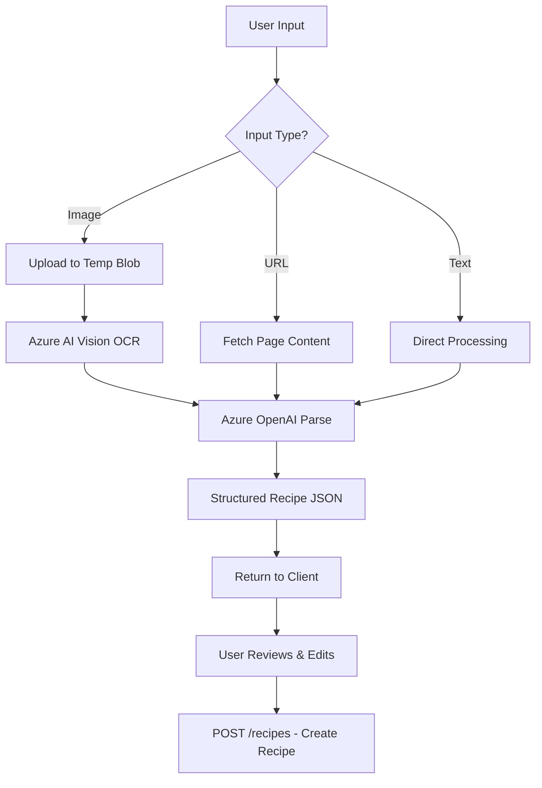

# GenAI Recipe Extraction Feature Plan

## Overview

This document outlines the plan to integrate GenAI-powered recipe extraction into the Meal Plan Organizer application. The feature allows users to extract structured recipe data from:

- **Uploaded images** (photos of cookbooks, handwritten recipes, screenshots)
- **Pasted text** (copied from websites or documents)
- **URLs** (direct links to recipe websites)

## Architecture Decision

### Chosen Approach: Hybrid Azure OpenAI + Azure AI Vision

After evaluating multiple options, we selected **Option 3: Hybrid** for the following reasons:

| Option | Approach | Monthly Cost (est.) | Pros | Cons |
|--------|----------|---------------------|------|------|
| 1 | Azure OpenAI only (text/URL) | ~$0.40 | Simple, low cost | No image support |
| 2 | Azure AI Vision + OpenAI (image only) | ~$0.30 | Cheap OCR | Two-step process |
| **3** | **Hybrid (all input types)** | **~$1.50** | **Full flexibility, best UX** | Slightly higher cost |
| 4 | Open-source (Tesseract, recipe-scrapers) | ~$0 | Free | Lower accuracy, maintenance burden |

**Selected: Option 3** provides the best user experience with costs well within the $50/month budget.

## Cost Analysis

### Assumptions (Family of 4)
- ~100 recipe extractions per month (25 per family member)
- ~50 image-based extractions, ~30 URL extractions, ~20 text extractions
- Average image size: 1-3 MB (compressed on client)
- Average tokens per extraction: ~2,000 (input + output)

### Estimated Monthly Costs

| Service | Usage | Unit Cost | Monthly Cost |
|---------|-------|-----------|--------------||
| Azure OpenAI (gpt-4o) | 100 extractions × 2K tokens | $0.005/1K input + $0.015/1K output | ~$1.00 |
| Azure AI Vision (Read API) | 50 images | $1.50/1K images | ~$0.08 |
| Azure Functions (extraction endpoint) | ~100 invocations | Consumption tier | ~$0.01 |
| Azure Blob Storage (temp images) | ~150 MB | $0.02/GB | ~$0.01 |
| **Total GenAI Feature** | | | **~$1.10/month** |

### Budget Impact

| Category | Before | After | Change |
|----------|--------|-------|--------|
| Current Azure spend | ~$15-20/month | ~$17-22/month | +$1.50 |
| Budget remaining | ~$30-35/month | ~$28-33/month | Minimal impact |

✅ **Well within $50/month budget constraint**

## Technical Design

### New API Endpoint

```
POST /recipes/extract
Content-Type: multipart/form-data (image) or application/json (text/URL)
Authorization: Bearer {JWT}

Request (Image):
{
  "inputType": "image",
  "image": <base64 or form-data file>
}

Request (URL):
{
  "inputType": "url",
  "url": "https://example.com/recipe/chocolate-cake"
}

Request (Text):
{
  "inputType": "text",
  "text": "Chocolate Cake\n\nIngredients:\n- 2 cups flour\n..."
}

Response:
{
  "success": true,
  "confidence": 0.92,
  "extractedRecipe": {
    "name": "Chocolate Cake",
    "description": "A rich, moist chocolate cake...",
    "cuisineType": "Dessert",
    "prepMinutes": 20,
    "cookMinutes": 35,
    "servings": 12,
    "ingredients": [
      { "name": "all-purpose flour", "quantity": 2.0, "unit": "cups" },
      { "name": "cocoa powder", "quantity": 0.75, "unit": "cups" },
      ...
    ],
    "steps": [
      { "stepNumber": 1, "instruction": "Preheat oven to 350°F..." },
      ...
    ]
  },
  "sourceImageUrl": "https://storage.../temp/extract-abc123.jpg" // if image input
}
```

### Processing Flow



### Azure Services

#### Azure OpenAI Service
- **Model**: `gpt-4o` with vision capability
- **Deployment Region**: Canada Central (same region as other resources)
- **SKU**: S0 (standard)
- **Quota**: 10K tokens/minute (sufficient for family use)

#### Azure AI Vision (Optional Enhancement)
- **API**: Read API (OCR)
- **SKU**: S1
- **Use Case**: Pre-process images for better text extraction before OpenAI

### Data Model Changes

#### RecipeIngredient Enhancement
```csharp
public class RecipeIngredient
{
    public Guid RecipeIngredientId { get; set; }
    public Guid RecipeId { get; set; }
    public string Name { get; set; }
    public decimal? Quantity { get; set; }      // Numeric quantity (new)
    public string? Unit { get; set; }            // Unit of measure (new)
    public string? QuantityText { get; set; }   // Original text (existing, renamed)
    
    public Recipe Recipe { get; set; }
}
```

#### Recipe Extraction Metadata (Optional)
```csharp
public class Recipe
{
    // ... existing properties ...
    
    // New extraction metadata
    public bool IsExtractedFromImage { get; set; } = false;
    public string? SourceImageUrl { get; set; }
    public decimal? ExtractionConfidence { get; set; }
}
```

### Authentication & Authorization

- **Authentication**: Reuse existing JWT/Entra External ID pattern
- **Authorization**: Extraction tied to authenticated user's household
- **Rate Limiting**: 100 extractions/user/day (prevent abuse)
- **Audit**: Log all extraction attempts to Application Insights

### Error Handling

| Scenario | Response | User Action |
|----------|----------|-------------|
| Image too large (>10 MB) | 400 Bad Request | Compress image |
| Unreadable image | 200 with low confidence | Manual entry suggested |
| URL blocked/inaccessible | 400 Bad Request | Paste text instead |
| OpenAI service unavailable | 503 Service Unavailable | Retry later |
| Rate limit exceeded | 429 Too Many Requests | Wait or manual entry |

## Implementation Plan

### Phase 1: Infrastructure (Week 1)
- [x] Deploy Azure OpenAI Service via Bicep
- [x] Deploy Azure AI Vision API via Bicep (optional)
- [x] Configure Key Vault secrets for API keys
- [x] Update local.settings.json for development

### Phase 2: Backend (Week 2)
- [ ] Create `RecipeExtractionService.cs` (OpenAI wrapper)
- [ ] Create `ExtractRecipeFromImage.cs` Azure Function
- [ ] Add database migration for RecipeIngredient.Unit
- [ ] Implement rate limiting middleware
- [ ] Add Application Insights telemetry

### Phase 3: Mobile Integration (Week 3)
- [ ] Add extraction UI in MAUI app (camera/gallery/paste)
- [ ] Implement extraction preview screen
- [ ] Add edit capability before saving
- [ ] Handle offline scenarios (queue for later)

### Phase 4: Testing & Deployment (Week 4)
- [ ] Unit tests for extraction service
- [ ] Integration tests with sample images
- [ ] Load testing (100 extractions)
- [ ] Deploy to dev environment
- [ ] User acceptance testing
- [ ] Deploy to production

## Files to Create/Modify

### New Files
- `src/MealPlanOrganizer.Functions/Functions/ExtractRecipeFromImage.cs`
- `src/MealPlanOrganizer.Functions/Services/RecipeExtractionService.cs`
- `src/MealPlanOrganizer.Functions/Services/IRecipeExtractionService.cs`
- `src/MealPlanOrganizer.Functions/Models/RecipeExtractionRequest.cs`
- `src/MealPlanOrganizer.Functions/Models/RecipeExtractionResponse.cs`
- `infra/bicep/phase-5/openai.bicep` (or add to existing phase)

### Modified Files
- `src/MealPlanOrganizer.Functions/Program.cs` - Register OpenAI services
- `src/MealPlanOrganizer.Functions/Data/Entities/RecipeIngredient.cs` - Add Unit
- `src/MealPlanOrganizer.Functions/Data/Entities/Recipe.cs` - Add extraction metadata
- `src/MealPlanOrganizer.Functions/Data/AppDbContext.cs` - Update model builder
- `docs/architecture/ARCHITECTURE.md` - Document new endpoint and services
- `PROJECT_SPEC.md` - Add extraction feature to core features

### Database Migration
```sql
-- Add Unit column to RecipeIngredient
ALTER TABLE RecipeIngredients ADD Unit NVARCHAR(50) NULL;

-- Add extraction metadata to Recipe (optional)
ALTER TABLE Recipes ADD IsExtractedFromImage BIT NOT NULL DEFAULT 0;
ALTER TABLE Recipes ADD SourceImageUrl NVARCHAR(MAX) NULL;
ALTER TABLE Recipes ADD ExtractionConfidence DECIMAL(3,2) NULL;
```

## Monitoring & Observability

### Custom Telemetry Events
- `RecipeExtractionRequested` - Input type, user, household
- `RecipeExtractionCompleted` - Confidence, token usage, duration
- `RecipeExtractionFailed` - Error type, input type

### Application Insights Queries
```kusto
// Extraction success rate
customEvents
| where name == "RecipeExtractionCompleted" or name == "RecipeExtractionFailed"
| summarize 
    total = count(),
    success = countif(name == "RecipeExtractionCompleted"),
    failed = countif(name == "RecipeExtractionFailed")
| extend success_rate = round(100.0 * success / total, 2)

// Average confidence by input type
customEvents
| where name == "RecipeExtractionCompleted"
| extend inputType = tostring(customDimensions.inputType)
| extend confidence = todouble(customDimensions.confidence)
| summarize avg_confidence = avg(confidence) by inputType

// Token usage and cost tracking
customEvents
| where name == "RecipeExtractionCompleted"
| extend tokens = toint(customDimensions.totalTokens)
| summarize 
    total_tokens = sum(tokens),
    avg_tokens = avg(tokens),
    extractions = count()
| extend estimated_cost = total_tokens * 0.00002 // Adjust rate as needed
```

### Alerts
- Error rate > 10% over 1 hour
- Average latency > 10 seconds
- Daily extraction count > 500 (unexpected spike)

## Security Considerations

1. **API Key Protection**: Store OpenAI/Vision keys in Key Vault; never expose to client
2. **Input Validation**: Sanitize URLs, limit image sizes, validate content types
3. **Data Privacy**: Don't log recipe content; only log metadata
4. **Rate Limiting**: Prevent abuse with per-user limits
5. **CORS**: Restrict to mobile app origins only

## Risks & Mitigations

| Risk | Likelihood | Impact | Mitigation |
|------|------------|--------|------------|
| OpenAI costs exceed estimate | Low | Medium | Set budget alerts; use cheaper model if needed |
| Extraction accuracy issues | Medium | Low | User review step; confidence scoring |
| Service unavailability | Low | Medium | Graceful fallback to manual entry |
| Image processing latency | Medium | Low | Async processing with status polling |
| Model deprecation | Low | Low | Abstract service layer; easy model swap |

## Future Enhancements

1. **Batch extraction** - Process multiple images at once
2. **Recipe deduplication** - Detect similar recipes already in database
3. **Ingredient normalization** - Map extracted ingredients to standard pantry items
4. **Nutrition extraction** - Parse nutritional information if present
5. **Multi-language support** - Extract recipes in other languages
6. **Voice input** - Dictate recipes for extraction

## References

- [Azure OpenAI Service Documentation](https://learn.microsoft.com/en-us/azure/ai-services/openai/)
- [Azure OpenAI Pricing](https://azure.microsoft.com/en-us/pricing/details/cognitive-services/openai-service/)
- [Azure AI Vision Documentation](https://learn.microsoft.com/en-us/azure/ai-services/computer-vision/)
- [Azure AI Vision Pricing](https://azure.microsoft.com/en-us/pricing/details/cognitive-services/computer-vision/)
- [GPT-4 Vision Capabilities](https://platform.openai.com/docs/guides/vision)

---

*Last Updated: February 3, 2026*
*Status: Phase 1 Complete - Infrastructure deployed*
